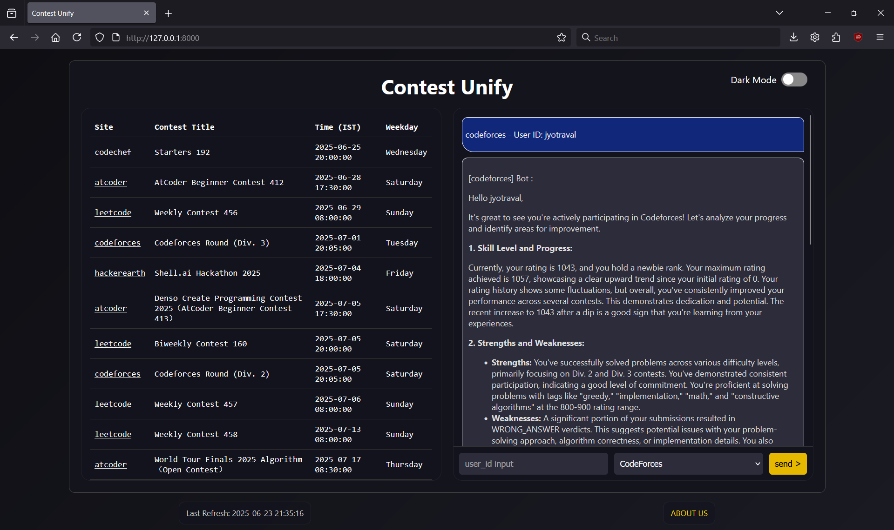
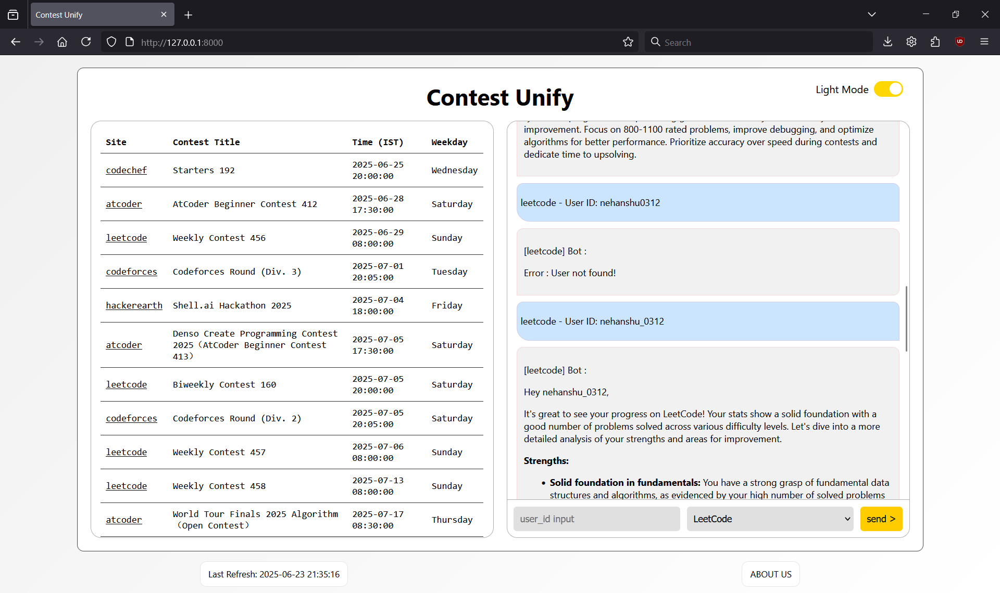
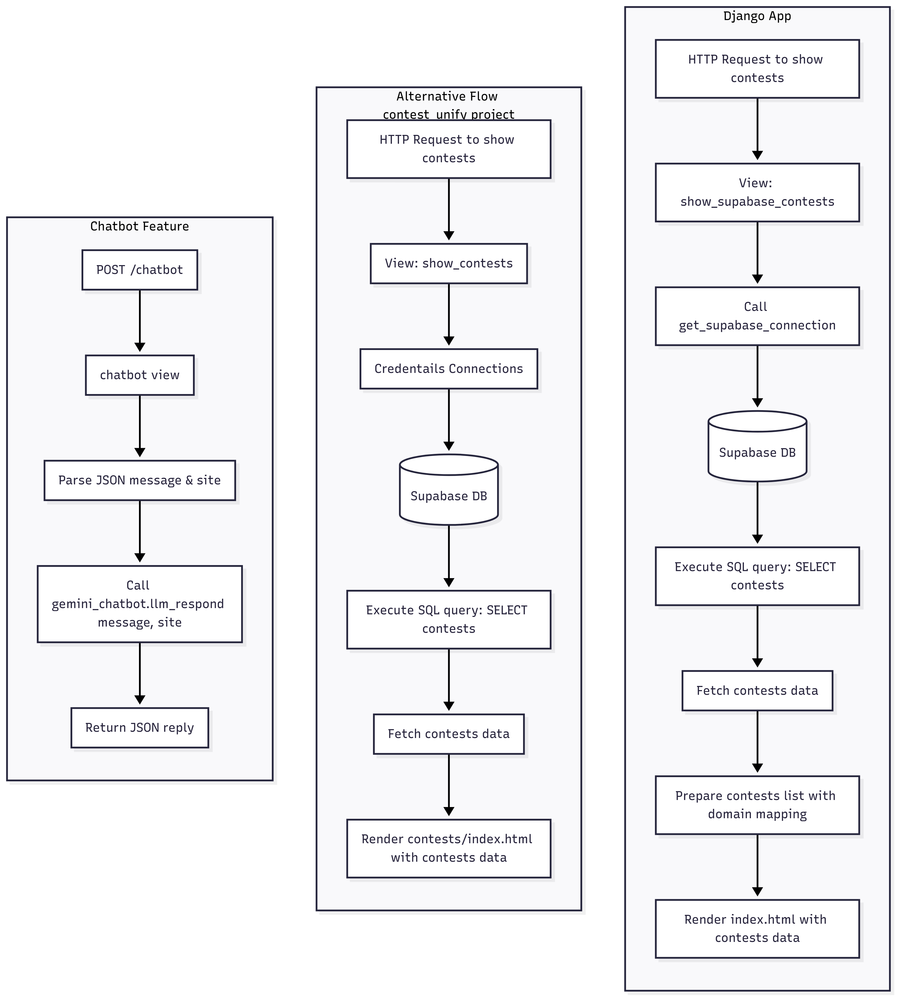

# ⚡ ContestUnify

ContestUnify is a centralized platform tailored for students practicing **Data Structures & Algorithms (DSA)** and **Competitive Programming (CP)**. It removes the hassle of manually tracking contests and enhances your preparation with personalized feedback — powered by AI.

> One platform for all your contest needs — find contests, track performance, and get actionable insights using Gemini 1.5.

---

## Table of Contents

- 🚀 Overview  
- 📁 Project Structure  
- 🛠️ Tech Stack 
- ⚙️ Features  
- 🧩 Setup & Installation  
- 🧪 Usage  
- 📸 Screenshots
- 🧭 Architecture Overview
- 📞 Contact
---

## 🚀 Overview

ContestUnify aims to serve as a one-stop platform to unify aspects of competitive programming contests, like problem listings, user submissions, and dataset visualizations. It currently combines a Django-based backend, a simple frontend using templates, and an integrated chatbot interface for automated assistance and account of contest-related queries.

---

## 📁 Project Structure

contest_unify/

├── backend_contest_unify/ # Django project folder

│ ├── backend.py # For total connection and logic of backend

│ └── README.md # For total information about Backend

│

├── contest/ # Core app: fetches & displays contests

│ ├── views.py

│ ├── urls.py

│ └── connection.py # Connects Django with Supabase

│

├── chatbot_app/ # Chatbot using Gemini 1.5

│ ├── views.py

│ └── prompts/

│

├── templates/ # Global HTML templates

├── requirements.txt # Python dependencies

└── .github/workflows/ # GitHub Actions (CI/CD)

---

- **backend_contest_unify/**: Django project backend folder  
- **chatbot_app/**: Handles AI-assisted functionalities   
- **contest/**: Core app managing contests — models, processing logs, etc.  
- **templates/**: HTML templates for the web interface  
- **.github/workflows/**: CI integrations, testing pipelines  
- **requirements.txt**: List of Python libraries  
---
## 🛠️ Tech Stack

- **Backend**: Python, Django  
- **Database**: [Supabase](https://supabase.io/)  
- **Frontend**: HTML, Django Templates  
- **AI Integration**: Google Gemini 1.5 (via chatbot)  
- **Deployment**: [Railway](https://railway.app/)  
- **CI/CD**: GitHub Actions 

---
## 🔌 Supabase Integration

Contest data is stored in **Supabase**. A custom file, `connection.py`, handles DB connectivity using credentials stored securely via environment variables.

### ✅ Environment Variables

Example `.env` file:
user=your_db_user

password=your_db_password

host=your_db_host

port=your_db_port

dbname=your_db_name

SUPABASE_USER=postgres.------------------

SUPABASE_PASSWORD=abcdefg123456789

SUPABASE_HOST=-------------------

SUPABASE_PORT=XXXX

SUPABASE_DB=postgres

GEMINI_API=your_gemini_api_key

---
## 🧩 Setup & Installation

### 1. Clone the repository

`git clone https://github.com/jyotraval/contest_unify.git cd contest_unify`

### 2. Create and activate virtual environment

`python -m venv venv source venv/bin/activate # On Windows: venv\Scripts\activate`

### 3. Install Python dependencies

`pip install -r requirements.txt`

### 4. Add environment variables

Create a `.env` file and populate it using the provided `.env.example`.

### 5. Run the server locally
`python manage.py runserver` 

Open [http://127.0.0.1:8000/](http://127.0.0.1:8000/) in your browser.

## 🧪 Usage

-   Browse contests pulled from public APIs and served via Supabase
    
-   Click on any contest to open its platform-specific URL
    
-   Chat with the built-in AI bot for insights about your CP profiles
    
-   No sign-up or login required — immediate use
## 🤖 Chatbot Integration (Gemini 1.5)

The `chatbot_app` integrates **Google Gemini 1.5 Flash** to provide:

-   Feedback on user performance (e.g., Codeforces handle analysis)
    
-   Suggestions to improve rankings and consistency
    
-   Platform-specific strategy tips
- ## 🚀 Deployment (Railway)

The app is deployed on [Railway](https://railway.app/) for public access.

> Deployment URL will be added here once finalized.

If you'd like to deploy your fork, you can:

1.  Push this repo to your GitHub
    
2.  Create a project on Railway
    
3.  Connect your repo and set environment variables
    
4.  Done! 🚀

## 📸 Screenshots
### 🔹 Dark Mode UI

### 🔹 Light Mode UI – Homepage

### 🧭 Architecture Overview
---
### 🔹Overview 

## 📞 Contact

**Maintainer:** [Jyot Raval](https://github.com/jyotraval)  
📬 Email: _ravaljyotg@gmail.com_  

**Maintainer** [Nehanshu Rathod](https://github.com/NehanshuRathod)  
📬 Email: _nehanshu1707@gmail.com_ 
